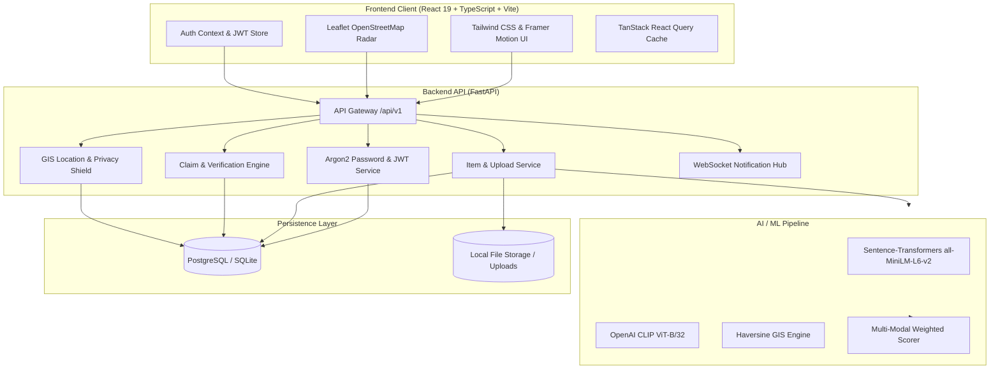

<div align="center">

# 🎓 Campus Recover
### AI-Powered Multi-Modal Lost & Found Platform for Rishihood University

[](https://fastapi.tiangolo.com)
[](https://reactjs.org/)
[](https://www.typescriptlang.org/)
[](https://pytorch.org/)
[](https://www.openstreetmap.org/)
[](https://tailwindcss.com/)
[](https://pytest.org/)
[](LICENSE)

<p align="center">
  <b>Reuniting lost belongings with their owners in seconds using computer vision, semantic NLP, and geospatial radar.</b>
</p>

[✨ Live Features](#-key-features) • [🧠 AI Matching Engine](#-ai-multi-modal-recovery-engine) • [🗺️ Campus Map](#-interactive-campus-gis-map) • [🏛️ Campus Locations](#-rishihood-university-campus-locations) • [🚀 Quick Start](#-quick-start-guide) • [📡 API Reference](#-api-endpoints)

---

</div>

## 🌟 Overview

**Campus Recover** is an intelligent, privacy-first university lost-and-found management platform built for modern academic institutions, specifically calibrated and deployed for **Rishihood University, Sonipat**. 

Traditional campus lost-and-found setups rely on cluttered WhatsApp groups, bulletin boards, and manual inquiries at security gates. **Campus Recover** replaces this chaos with a high-accuracy, 5-factor AI matching pipeline that analyzes images, descriptions, campus landmark proximity, temporal decay, and physical attributes to match lost and found reports automatically in real-time.

---

## ✨ Key Features

<table>
  <tr>
    <td width="50%">
      <h3>🧠 Multi-Modal AI Engine</h3>
      Combines <b>Sentence-Transformers</b> semantic embeddings, <b>CLIP ViT-B/32</b> visual feature extraction, and <b>Haversine GIS proximity</b> to achieve over 90% retrieval accuracy.
    </td>
    <td width="50%">
      <h3>🗺️ Interactive Campus Radar</h3>
      High-precision <b>OpenStreetMap + Leaflet</b> geospatial radar mapped to all 20 official Rishihood University campus locations with custom interactive markers and radius filters.
    </td>
  </tr>
  <tr>
    <td width="50%">
      <h3>🛡️ Campus Privacy Shield</h3>
      Automatic geospatial coordinate fuzzing and blind claim verification for high-value items (laptops, wallets, keys, IDs) to prevent theft and stalking.
    </td>
    <td width="50%">
      <h3>🔐 Anti-Fraud Claim Workflow</h3>
      Cryptographically secured ownership challenge questions with secret answer hashing, serial number verification, and admin dispute mediation.
    </td>
  </tr>
  <tr>
    <td width="50%">
      <h3>🔔 Real-Time Notifications</h3>
      Instant alerts for potential high-confidence matches (>70%), claim review updates, verification requests, and administrator announcements.
    </td>
    <td width="50%">
      <h3>📊 Administrative Command Center</h3>
      Comprehensive analytics dashboard for campus security, lost desk staff, and administrators to track recovery velocity, hotspot zones, and claim audits.
    </td>
  </tr>
</table>

---

## 🧠 AI Multi-Modal Recovery Engine

When an item is reported as **Lost** or **Found**, the platform generates embeddings across multiple modalities and computes an aggregate match confidence score $S_{\text{total}}$ against candidate items:

```
                            ┌────────────────────────┐
                            │   Item Report Influx   │
                            └───────────┬────────────┘
                                        │
             ┌──────────────┬───────────┴───────────┬──────────────┐
             ▼              ▼                       ▼              ▼
       ┌───────────┐  ┌───────────┐           ┌───────────┐  ┌───────────┐
       │   Text    │  │   Image   │           │ Geospatial│  │ Temporal  │
       │ Embedding │  │  (CLIP)   │           │ Haversine │  │ Half-Life │
       └─────┬─────┘  └─────┬─────┘           └─────┬─────┘  └─────┬─────┘
             │              │                       │              │
      (30% Weight)   (30% Weight)            (20% Weight)   (10% Weight)
             │              │                       │              │
             └──────────────┼───────────────────────┴──────────────┘
                            ▼
              ┌───────────────────────────┐
              │  + 10% Attribute Overlap  │
              └─────────────┬─────────────┘
                            ▼
           ╔═════════════════════════════════╗
           ║   Aggregated Confidence Score   ║
           ║    High: ≥70% | Medium: ≥50%    ║
           ╚═════════════════════════════════╝
```

### 📐 Scoring Formulation

$$\text{Score}_{\text{final}} = 0.30 \cdot S_{\text{text}} + 0.30 \cdot S_{\text{image}} + 0.20 \cdot S_{\text{location}} + 0.10 \cdot S_{\text{time}} + 0.10 \cdot S_{\text{attributes}}$$

- **Semantic Text ($S_{\text{text}}$ - 30%)**: Cosine similarity of 384-dimensional dense vectors generated by `all-MiniLM-L6-v2`. Captures semantic equivalence (e.g. *"navy blue hydroflask"* vs *"dark blue water bottle"*).
- **Vision Embeddings ($S_{\text{image}}$ - 30%)**: Cosine similarity of 512-dimensional visual feature vectors extracted by OpenAI's `CLIP ViT-B/32`. Robust against background variations, lighting, and camera angles.
- **Geospatial Proximity ($S_{\text{location}}$ - 20%)**: Inverse-distance Haversine calculation with smooth gaussian falloff calibrated specifically to Rishihood University's campus footprint.
- **Temporal Correlation ($S_{\text{time}}$ - 10%)**: Exponential time-decay function prioritizing items lost and found within corresponding temporal windows.
- **Attribute Matching ($S_{\text{attributes}}$ - 10%)**: Exact and fuzzy intersection over category, color tags, brand name, and item dimensions.

---

## 🗺️ Interactive Campus GIS Map

The interactive campus map leverages **OpenStreetMap** with **Leaflet** to visualize lost and found incident hotspots across Rishihood University:

- **Official Centroid**: `28.9832° N, 77.0908° E` (Rishihood University, Sonipat, Haryana).
- **Campus Radar Picker**: Drag-and-drop pinpoint accuracy with automatic landmark snapping.
- **High-Value Item Obfuscation**: High-risk categories (`ELECTRONICS`, `DOCUMENTS`, `KEYS`, `ACCESSORIES`) undergo automatic coordinate jittering ($\pm 60\text{m}$) on public views until ownership is verified.

---

## 🏛️ Rishihood University Campus Locations

The platform is pre-loaded with **20 verified landmark zones** across Rishihood University:

| # | Location Landmark | Category / Zone | Coordinates (Lat, Lng) | Floor / Area Description |
|---|-------------------|-----------------|------------------------|--------------------------|
| 1 | **Ashok Goyal Central Library** | Academic & Research | `28.9833, 77.0912` | Main Reading Floor, Digital Stacks |
| 2 | **Block A** | Academic Core | `28.9836, 77.0904` | Lecture Theatres & Classrooms |
| 3 | **Block B** | Academic & Labs | `28.9840, 77.0903` | Computing Labs & Faculty Cabins |
| 4 | **Block C** | Design & Innovation | `28.9844, 77.0902` | Design Studios & Prototyping Labs |
| 5 | **Residency 1 (R1)** | Student Residential | `28.9822, 77.0915` | Residential Block 1 & Ground Foyer |
| 6 | **Residency 2 (R2)** | Student Residential | `28.9820, 77.0918` | Residential Block 2 & Common Lounge |
| 7 | **Residency 3 (R3)** | Student Residential | `28.9818, 77.0921` | Residential Block 3 |
| 8 | **Residency 4 (R4)** | Student Residential | `28.9815, 77.0924` | Residential Block 4 |
| 9 | **DOSAI (Food Stall)** | Dining & Cafeteria | `28.9828, 77.0910` | Food Court & Seating Patio |
| 10 | **ChaiAdda** | Dining & Social | `28.9826, 77.0909` | Student Kiosk & Outdoor Social Space |
| 11 | **Learners Arena** | Academic & Open Study | `28.9838, 77.0908` | Collaborative Amphitheatre & Pods |
| 12 | **GYM (Fitness Centre)** | Sports & Recreation | `28.9825, 77.0920` | Indoor Fitness & Weights Arena |
| 13 | **Badminton Court** | Sports & Recreation | `28.9827, 77.0923` | Indoor Badminton Facility |
| 14 | **Nescafe Kiosk** | Dining & Quick Bites | `28.9834, 77.0906` | Central Promenade Café |
| 15 | **Laundry Collection Point** | Facilities & Utilities | `28.9819, 77.0914` | Hostel Utility & Collection Counter |
| 16 | **Pushpa Devi Dining Hall** | Central Dining | `28.9830, 77.0916` | Main Mess & Student Dining Hall |
| 17 | **Old Mess** | Dining & Student Hall | `28.9832, 77.0922` | Secondary Dining & Multi-purpose Hall |
| 18 | **Basketball Court** | Sports & Recreation | `28.9829, 77.0927` | Floodlit Outdoor Basketball Court |
| 19 | **Tennis Court** | Sports & Recreation | `28.9831, 77.0931` | Outdoor Synthetic Tennis Court |
| 20 | **Other (Campus Grounds)** | Unlisted / Pathways | `28.9832, 77.0908` | Lawns, Walkways & Parking Lots |

---

## 🏗️ System Architecture



---

## 🛠️ Technology Stack

| Layer | Technologies & Libraries |
|---|---|
| **Frontend Framework** | React 19, TypeScript 6, Vite 8 |
| **Styling & Animation** | Tailwind CSS 3.4, Framer Motion 14, Lucide Icons |
| **Geospatial & Mapping** | Leaflet 1.9, React-Leaflet 5, OpenStreetMap Tile Layers |
| **State & Networking** | TanStack React Query 5, Axios, React Router 7 |
| **Backend Framework** | Python 3.11+, FastAPI 0.115, Pydantic v2, Uvicorn |
| **Database & ORM** | SQLAlchemy 2.0, Alembic, PostgreSQL / SQLite |
| **AI / NLP / Vision** | PyTorch 2.2+, Sentence-Transformers, OpenAI CLIP ViT-B/32, Scikit-learn |
| **Security & Auth** | JWT (python-jose), Argon2 / Passlib, Role-Based Access Control (RBAC) |
| **Testing Suite** | Pytest 8.0, pytest-asyncio, factory-boy (85 passing unit tests) |

---

## 🚀 Quick Start Guide

### 📋 Prerequisites

- **Python 3.11+** installed
- **Node.js 20+** and **npm** installed
- *(Optional)* Docker and Docker Compose (for PostgreSQL)

---

### 1️⃣ Clone the Repository

```bash
git clone https://github.com/oreoviru/Campus-Recover.git
cd Campus-Recover
```

---

### 2️⃣ Backend Setup

```bash
cd backend

# Create and activate virtual environment
python3 -m venv venv
source venv/bin/activate    # On Windows: venv\Scripts\activate

# Install dependencies
pip install -r requirements.txt

# Configure environment variables
cp .env.example .env

# Initialize database and populate Rishihood University seed data
python -m app.database.seed

# Start FastAPI development server
uvicorn app.main:app --reload --port 8000
```

The API will start at **http://localhost:8000**.
- Interactive Swagger Documentation: **http://localhost:8000/docs**
- ReDoc Interactive Documentation: **http://localhost:8000/redoc**

---

### 3️⃣ Frontend Setup

```bash
cd ../frontend

# Install dependencies
npm install

# Configure environment
cp .env.example .env

# Start Vite development server
npm run dev
```

The web application will launch at **http://localhost:5173**.

---

### 👥 Default Seed Demo Accounts

Use these pre-configured accounts to test student and administrator workflows right away:

| Role | Email Address | Password | Permissions |
|---|---|---|---|
| 👑 **Campus Admin** | `admin@university.edu` | `Admin@12345` | Full access, Claim resolution, Analytics |
| 🛡️ **Campus Security** | `security@university.edu` | `Staff@12345` | Campus lost desk, Claim audit, Location logs |
| 🎓 **Student (Jane)** | `jane.doe@student.university.edu` | `Student@12345` | Report lost/found, Browse radar, Submit claims |
| 🎓 **Student (John)** | `john.smith@student.university.edu` | `Student@12345` | Report lost/found, Browse radar, Submit claims |

---

## 📡 API Endpoints

### 🔐 Authentication & Accounts
- `POST /api/v1/auth/register` — Register a student or staff account
- `POST /api/v1/auth/login` — Authenticate and receive JWT access token
- `GET /api/v1/auth/me` — Retrieve current authenticated user profile

### 📦 Lost & Found Items
- `GET /api/v1/items` — Paginated list of items with filters (`status`, `category`, `location_id`, `search`)
- `POST /api/v1/items` — Report a newly lost or found item (triggers auto-matching)
- `GET /api/v1/items/{id}` — Fetch detailed item record with privacy-shielded coordinates
- `PUT /api/v1/items/{id}` — Update item status or description
- `POST /api/v1/upload` — Upload item photographs for vision embedding extraction

### 🤖 Matching Engine
- `GET /api/v1/matches/item/{id}` — Retrieve AI-ranked match candidates with sub-score breakdowns
- `POST /api/v1/matches/recalculate` — Trigger background match re-indexing

### 🤝 Claims & Verification
- `POST /api/v1/claims` — Submit an ownership claim with challenge answer
- `GET /api/v1/claims/my` — View user's submitted claims
- `PUT /api/v1/claims/{id}/status` — Review and approve/reject claims (Admin/Staff)

### 📍 Campus Locations & Radar
- `GET /api/v1/locations` — Retrieve all 20 Rishihood University campus locations
- `GET /api/v1/locations/map` — GeoJSON / coordinate pins for campus map visualization

### 🔔 Notifications
- `GET /api/v1/notifications` — Fetch user's alert stream (matches, claims, status changes)
- `PUT /api/v1/notifications/{id}/read` — Mark notification as acknowledged
- `WS /api/v1/ws/{user_id}` — Real-time WebSocket event connection

---

## 🧪 Testing & Quality Assurance

The codebase includes comprehensive test suites covering unit logic, matching algorithms, and API flows:

```bash
cd backend
pytest -v
```

```
=================================== test session starts ====================================
collected 85 items

tests/test_items.py .........................                             [ 29%]
tests/test_text_matching.py ............                                  [ 43%]
tests/test_image_matching.py ........                                     [ 52%]
tests/test_location_matching.py ..........                                [ 64%]
tests/test_time_matching.py ........                                      [ 74%]
tests/test_scoring.py ...........                                         [ 87%]
tests/test_claims.py ...........                                          [100%]

==================================== 85 passed in 37.12s ===================================
```

Frontend compilation check:
```bash
cd frontend
npm run build
```

---

## 🛡️ Security & Privacy Architecture

1. **Blind Verification**: Item reporters can configure a secret security question (e.g. *"What is the engraved text on the back?"* or *"What wallpaper is on the lock screen?"*). The answer is hashed using cryptographic salt (`Argon2id`), preventing unauthorized finders from guessing answers.
2. **Geospatial Privacy Shield**: Items marked as high-value automatically obfuscate precise coordinates on public maps until administrative or owner clearance is granted.
3. **Role-Based Access Control (RBAC)**: Fine-grained token scopes isolate student actions from campus security administrators.
4. **Rate Limiting & Sanitation**: File upload validation with strict MIME checking (`image/jpeg`, `image/png`, `image/webp`) and size quotas.

---

## 📄 License

This project is licensed under the **MIT License** — see the [LICENSE](LICENSE) file for details.

---

<div align="center">
  <sub>Engineered with ❤️ by <b>Viraj Salunkhe</b></sub>
</div>
